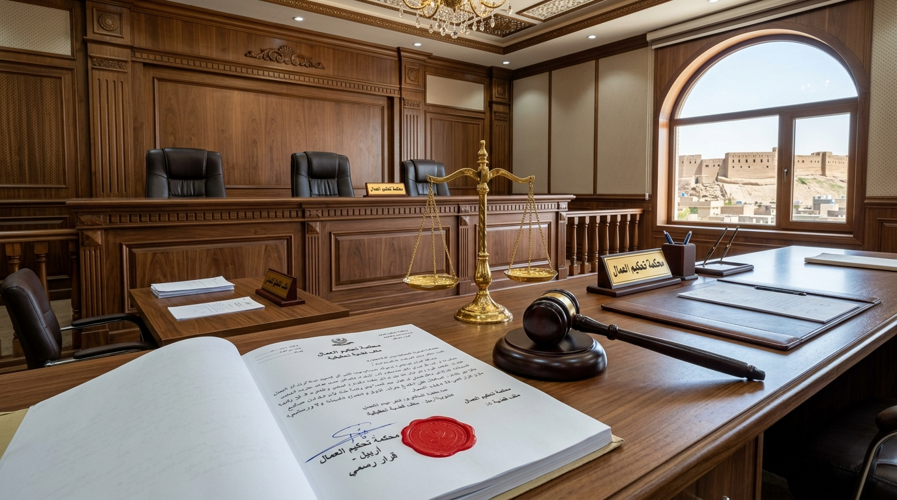

# تقرير دراسي أكاديمي متخصص في مادة قانون الأعمال (Business Law)
## الموضوع: إنهاء عقد العمل بإرادة أحد طرفيه أو كليهما
**دراسة تحليلية تأصيلية ومقارنة وفقاً للمبحث الثاني (الصفحات 324 - 366) من كتاب "قانون العمل"**  
**المؤلفون:** د. عدنان العابد (جامعة بغداد) & د. يوسف إلياس (معهد الإدارة - بغداد)  
**إشراف الأستاذة:** م.م. هالة رحمن (Ass.L. Hala Rahman)  

---

<!-- PAGE BREAK: PAGE 1 -->
## [الصفحة 1]: غلاف التقرير الأكاديمي الفاخر (Title Page)

- **الدولة والجهة الأكاديمية:** جمهورية العراق - وزارة التعليم العالي والبحث العلمي - كلية القانون / إدارة الأعمال
- **المادة الدراسية:** قانون الأعمال (Business Law)
- **أستاذة المادة والمشرفة:** م.م. هالة رحمن (Ass.L. Hala Rahman)
- **عنوان التقرير:** **إنهاء عقد العمل بإرادة أحد طرفيه أو كليهما**
- **المرجع الدراسي المعتمد:** كتاب "قانون العمل" - تأليف: الدكتور عدنان العابد & الدكتور يوسف إلياس، الفصل الخامس: انتهاء عقد العمل، المبحث الثاني (ص 324 - 366).
- **العام الدراسي:** 2026

---

<!-- PAGE BREAK: PAGE 2 -->
## [الصفحة 2]: المطلب الأول - انتهاء العقد باتفاق إرادتي طرفيه (التقايل الرضائي)

### تمهيد ومقدمة عامة
يقوم عقد العمل في جوهره على التراضي المتبادل؛ واستناداً إلى القاعدة القانونية الراسخة **"العقد شريعة المتعاقدين"**، فإن الرابطة العقدية التي ولدت باتفاق الطرفين يجوز أن تنحل باتفاقهما المتبادل، وهو ما يعرف في الاصطلاح القانوني بـ **(التقايل أو التفاسخ الرضائي - Mutual Agreement Termination)**. ويُعد هذا الإنهاء تعبيراً حراً عن سلطان الإرادة ما لم يتعارض مع القواعد القانونية الآمرة الحامية للعمال.

*الشكل (1): مشهد يمثل التقايل والاتفاق الرضائي المكتوب بين العامل ورب العمل لإنهاء الخدمة وتسوية المستحقات — إطلالة فندق ديفان أربيل*

### 1. الشروط الموضوعية والشكلية لصحة التقايل
لكي يكون الاتفاق على إنهاء العقد نافذاً ومبرئاً للذمة، يشترط الفقه القانوني توافر أركان أساسية:
1. **التراضي الحر السليم:** أن تكون إرادة العامل خالية تماماً من عيوب الرضا كالإكراه (سواء كان إكراهاً مادياً أو معنوياً بالتهديد بالفصل التأديبي الباطل) والتدليس.
2. **الأهلية القانونية:** تمتع الطرفين بأهلية التصرف وإبراء الذمة وقت توقيع اتفاق الإنهاء.
3. **التوثيق والكتابة الرسمية:** يشترط قانون العمل ثبوت اتفاق الإنهاء كتابةً لمنع أي نزاع مستقبلي وضمان حقوق الطرف الأضعف.

### 2. الحماية القانونية للعامل وبطلان التنازل الإجباري
نص قانون العمل على قاعدة جوهرية تنتمي للنظام العام: **"يقع باطلاً كل اتفاق أو مصالحة تتضمن تنازل العامل عن أي حق من حقوقه المقررة قانوناً"** (مثل مكافأة نهاية الخدمة، أو بدل الإجازات السنوية، أو أجور الساعات الإضافية). وعليه، إذا انطوى التقايل على حرمان العامل من هذه الحقوق دون مقابل يعادلها أو يزيد عليها، اعتبر الشرط باطلاً وبقي حق العامل قائماً أمام القضاء.

### 3. الآثار القانونية المترتبة على التقايل
- انقضاء الرابطة العقدية بأثر فوري للمستقبل.
- تصفية مستحقات العامل المالية المستقرة فور التوقيع.
- التزام صاحب العمل بتسليم العامل شهادة خدمة مجانية تتضمن تاريخ البدء والانتهاء وطبيعة الوظيفة دون أي مساس بسمعته المهنية.

---

<!-- PAGE BREAK: PAGE 3 -->
## [الصفحة 3]: المطلب الثاني - إنهاء العقد بالإرادة المنفردة للعامل (الاستقالة والترك المشروع)

### مدخل تأصيلي
كرّس الدستور وقانون العمل مبدأ **حرية العمل** ورفض أي صورة من صور السخرة أو العمل القسري؛ ومن ثم يملك العامل الحق المطلق في إنهاء رابطة العمل إذا وجد فرصة أفضل أو رغب في ترك العمل، وذلك وفقاً لقواعد الإخطار القانوني أو حالات الترك الفوري المشروع.

*الشكل (2): تقديم العامل لطلب الاستقالة الرسمي المكتوب والالتزام بمهلة الإخطار القانونية — إطلالة أفق أربيل وقلعتها*

### 1. الاستقالة النظامية وضوابط مهلة الإخطار (Notice Period)
- **الإشعار المكتوب:** يجب أن يقدم العامل استقالته خطياً إلى صاحب العمل بصورة واضحة لا لبس فيها.
- **مهلة الإخطار القانونية:** يلزم القانون العامل بالاستمرار في أداء عمله لفترة محددة (عادة 30 يوماً في العقود غير محددة المدة) حتى يتسنى لصاحب العمل تأمين بديل مناسب.
- **الالتزام بالعمل أثناء المهلة:** يتقاضى العامل راتبه كاملاً خلال مهلة الإنذار؛ فإذا انقطع فجأة دون إخطار، جاز لرب العمل مطالبته ببدل مهلة الإنذار عما لحقه من ضرر.
- **حق العدول:** أجاز الفقه العمالي للعامل الرجوع عن الاستقالة خلال فترة وجيزة إذا ثبت تسرعه ولم يكن رب العمل قد تعاقد مع بديل بالفعل.

### 2. حالات الترك الفوري المشروع دون إخطار (الإنهاء المنسوب لخطأ رب العمل)
أجاز القانون للعامل مغادرة العمل فوراً دون أي إخطار مسبق، مع احتفاظه بكامل حقوقه ومكافأته وحقه في التعويض عن الفصل التعسفي الحكمي، في الحالات التالية:
1. **التخلف عن الوفاء بالأجر:** امتناع صاحب العمل عن دفع الراتب في المواعيد المقررة أو خفضه دون موافقة العامل.
2. **الاعتداء والمساس بالشرف:** وقوع اعتداء جسدي أو لفظي أو سلوك مخل بالآداب من صاحب العمل أو ممثله بحق العامل أو أحد أفراد أسرته.
3. **وجود خطر جسيم داهم:** وجود خطر يهدد حياة العامل أو صحته في بيئة العمل مع إهمال الإدارة اتخاذ تدابير السلامة والصحة المهنية.
4. **تغيير جوهر العمل (الغش التعاقدي):** إرغام العامل على أداء عمل يختلف جذرياً عن طبيعة عمله المتفق عليه بهدف التضييق عليه.

---

<!-- PAGE BREAK: PAGE 4 -->
## [الصفحة 4]: المطلب الثالث - إنهاء العقد بالإرادة المنفردة لصاحب العمل والفصل التعسفي

### الموازنة بين سلطة الإدارة وحماية الاستقرار العمالي
يتمتع صاحب العمل بسلطة تنظيم المنشأة، إلا أن قانون العمل قيد حقه في إنهاء العقد غير محدد المدة، حيث حظر إنهاء الخدمات دون وجود مسوغ جدي ومشروع، لمنع تحويل سلطة صاحب العمل إلى أداة للطرد التعسفي.

*الشكل (3): انعقاد جلسات التحقيق الإداري ومراجعة ملف إنهاء الخدمة لضمان مشروعية الأسباب — قاعة اجتماعات بأربيل*

### 1. الأسباب المشروعة لإنهاء العقد من جانب صاحب العمل
- **الأسباب الاقتصادية والهيكلية:** مثل إلغاء الوظيفة نتيجة تقليص النشاط أو الأزمات المالية، بشرط استيفاء موافقة لجان إنهاء الخدمة والجهات الرسمية في وزارة العمل.
- **عجز العامل المهني:** ثبوت تدني كفاءة العامل بعد إنذاره رسمياً ومنحه مهلة لتحسين أدائه أو تدريبه.
- **بلوغ سن التقاعد القانوني:** وصول العامل للسن المقررة قانوناً واستحقاقه المعاش التقاعدي للضمان الاجتماعي.

### 2. مفهوم الفصل التعسفي (Unfair Dismissal) ومعاييره
يُعد الفصل تعسفياً وباطلاً إذا كان الدافع وراءه غير مشروع، وأبرز هذه الصور:
- فصل العامل بسبب ممارسته لحقه في الانضمام للنقابات أو النشاط النقابي المشروع.
- فصل العامل بسبب تقدمه بشكوى أو إقامته دعوى قضائية للمطالبة بحقوقه ضد رب العمل.
- الإنهاء بدافع التمييز (الجنس، الدين، العرق، الرأي السياسي).
- إنهاء خدمات العاملة أثناء فترة إجازة الحمل والولادة والأمومة، أو العامل أثناء إجازته المرضية المقرة رسمياً.

### 3. الآثار القانونية المترتبة على ثبوت التعسف
1. **الحكم بإعادة العامل إلى وظيفته (Reinstatement):** كأصل عام في التشريعات الحمائية، مع صرف كامل رواتبه عن مدة التوقف.
2. **التعويض المالي الجابر للضرر:** في حال استحالة العودة، يلزم صاحب العمل بدفع تعويض مالي عادل يشمل: التعويض عن الضرر الأدبي والمادي، بدل مهلة الإخطار، ومكافأة نهاية الخدمة كاملة.

---

<!-- PAGE BREAK: PAGE 5 -->
## [الصفحة 5]: المطلب الرابع - الفصل التأديبي لارتكاب الخطأ الجسيم (ص 346 وما بعدها)

### مفهوم الخطأ الجسيم والفصل الجزائي
يمثل الفصل التأديبي أقصى درجات العقوبة التأديبية في لائحة الجزاءات، ويؤدي إلى حرمان العامل من عمله ومصدر معيشته فوراً دون إخطار. لذلك اشترط المرجع الدراسي وقانون العمل وقوع **"خطأ جسيم"** يستحيل معه استمرار العمل، وحدده القانون على سبيل الحصر.

*الشكل (4): الرقابة القضائية لمحكمة العمل ولجان التحكيم على قرارات الفصل التأديبي لضمان التناسب والعدالة — إطلالة قلعة أربيل*

### 1. الحالات الحصرية للخطأ الجسيم (وفقاً للصفحة 346 وما بعدها)
1. **الخطأ الجسيم المنشئ لضرر مادي جسيم:** إتلاف الآلات أو البضائع أو إهمال الصيانة بصورة تتسبب في خسائر مادية فادحة لصاحب العمل، ويشترط القانون أن يبلغ صاحب العمل الجهات المختصة (الشرطة ومكتب العمل) خلال (24 إلى 48 ساعة) من وقت علمه بالحادث لتوثيق الواقعة رسمياً.
2. **انتحال شخصية كاذبة أو تقديم مستندات مزورة:** تقديم شهادات أو وثائق مهنية مزورة لإتمام التعيين.
3. **إفشاء الأسرار الجوهرية للمنشأة:** كشف الأسرار الصناعية أو التقنية أو الحسابية للمنافسين بما يضر بالمنشأة ضرراً محققاً.
4. **التغيب غير المبرر عن العمل:** الانقطاع عن العمل دون سبب مشروع لأكثر من المدة المحددة قانوناً (مثلاً 10 أيام متصلة أو 20 يوماً متقطعة خلال السنة الواحدة)، شريطة إنذار العامل خطياً بعد انقضاء نصف المدة.
5. **الاعتداء على الإدارة أو الزملاء:** الاعتداء بالضرب أو السب المقذع أثناء تأدية العمل أو بسببه.

### 2. الضمانات الإجرائية الصارمة لتوقيع عقوبة الفصل
- **التحقيق الخطي الإلزامي:** استدعاء العامل خطياً وإجراء تحقيق موثق معه يثبت في محضر رسمي.
- **كفالة حق الدفاع:** تمكين العامل من الدفاع عن نفسه، إحضار شهود نفي، والاستعانة بممثل نقابي أو محامٍ.
- **التسبيب والتبليغ:** تسبيب قرار الفصل بوضوح وإخطار العامل به كتابةً خلال مهلة محددة، مع حقه المطلق في الطعن أمام محكمة العمل.

---

<!-- PAGE BREAK: PAGE 6 -->
## [الصفحة 6]: التحليل المقارن، النتائج وقائمة المراجع المعتمدة

### 1. جدول المقارنة التركيبي بين صور إنهاء عقد العمل

| وجه المقارنة | أولاً: التقايل الرضائي | ثانياً: استقالة العامل | ثالثاً: إنهاء صاحب العمل | رابعاً: الفصل التأديبي (خطأ جسيم) |
| :--- | :---: | :---: | :---: | :---: |
| **مصدر الإرادة** | إرادة الطرفين المشتركة | إرادة العامل المنفردة | إرادة رب العمل المنفردة | قرار عقابي صادر من الإدارة |
| **مهلة الإخطار (الإنذار)** | حسب اتفاق الطرفين | ملزمة (إلا بالحالات المبررة) | إلزامية ومقيدة بالأسباب | يسقط الحق فيها فوراً |
| **مكافأة نهاية الخدمة** | مستحقة كاملة | مستحقة وفق سنوات الخدمة | مستحقة كاملة + تعويض إن تعسف | قد يسقط الحق فيها أو ينقص |
| **التعويض عن الضرر** | لا يوجد لتراضيهما | لا يوجد (إلا عند مباغتة العمل) | مستحق للعامل عند التعسف | يحق لرب العمل طلب تعويض الضرر |
| **الرقابة القضائية** | التأكد من سلامة الرضا وعدم الإكراه | التأكد من حرية الإرادة | رقابة مشروعية مسوغ الإنهاء | رقابة ثبوت المخالفة وحق الدفاع |

*الشكل (5): دراسة مقارنة ومصادر التشريع العمالي في كتاب د. عدنان العابد ود. يوسف إلياس — أربيل / بغداد*

### 2. النتائج والتوصيات
1. **التوازن التشريعي:** راعى المشرع في قانون العمل الموازنة الدقيقة بين مقتضيات استقرار المشاريع الاقتصادية وحماية الطرف الضعيف (العامل) من فقدان رزقه تعسفياً.
2. **أهمية الإثبات الكتابي:** يُعد التوثيق الكتابي للإخطارات والمراسلات والتحقيقات الإدارية الضمانة الحاسمة لفض النزاعات وتحديد المسؤوليات القانونية.
3. **دور القضاء العمالي:** تؤدي محاكم العمل ولجان فض المنازعات دوراً جوهرياً في رقابة التناسب والتثبت من خلو قرارات الإنهاء من شائبة الكيد أو الانحراف بالسلطة.

### 3. قائمة المصادر والمراجع المعتمدة
1. **المرجع الدراسي الأساسي:**  
   - د. عدنان العابد (أستاذ قانون العمل والضمان المساعد بكلية القانون - جامعة بغداد) & د. يوسف إلياس (أستاذ مساعد بمعهد الإدارة - بغداد)، *كتاب قانون العمل*، الفصل الخامس: انتهاء عقد العمل، المبحث الثاني: إنهاء العقد بإرادة أحد طرفيه أو كليهما، الصفحات (324 - 366)، الناشر: دار العاتك لصناعة الكتاب - القاهرة، توزيع: المكتبة القانونية - بغداد.
2. **التشريع العمالي الوطني:** قانون العمل العراقي رقم (37) لسنة 2015 والتعليمات الوزارية الصادرة بموجبه.
3. **المقرر الجامعي:** مادة قانون الأعمال (Business Law)، إشراف الأستاذة: م.م. هالة رحمن (Ass.L. Hala Rahman).
4. **المعايير الدولية المقارنة:** اتفاقية منظمة العمل الدولية رقم (158) لعام 1982 بشأن إنهاء الاستخدام بمبادرة من أصحاب العمل.
